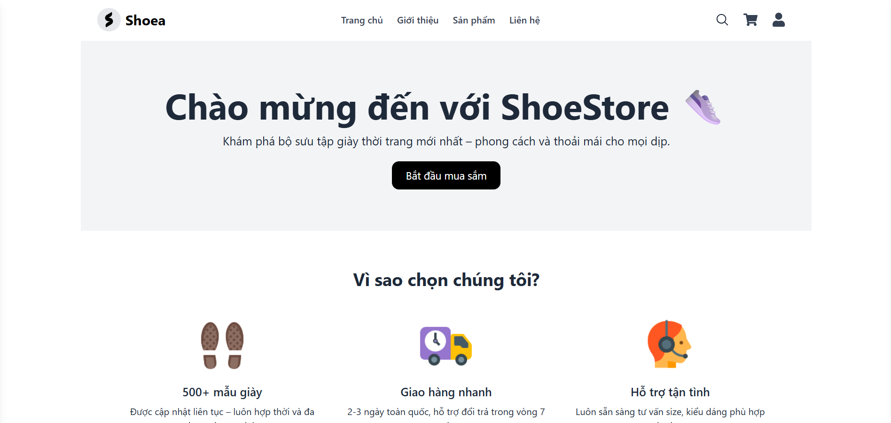
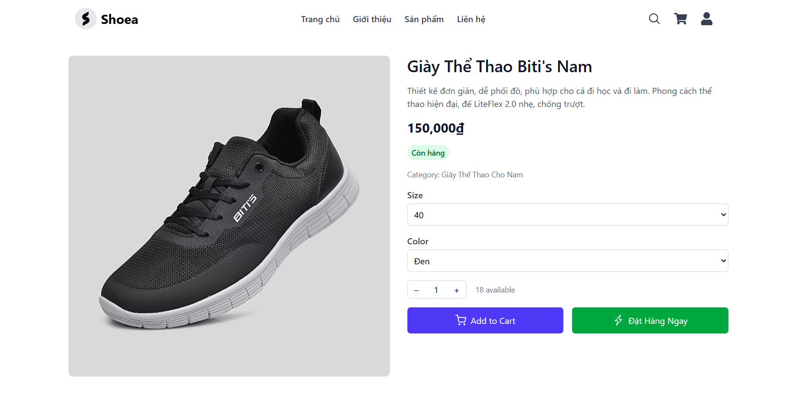
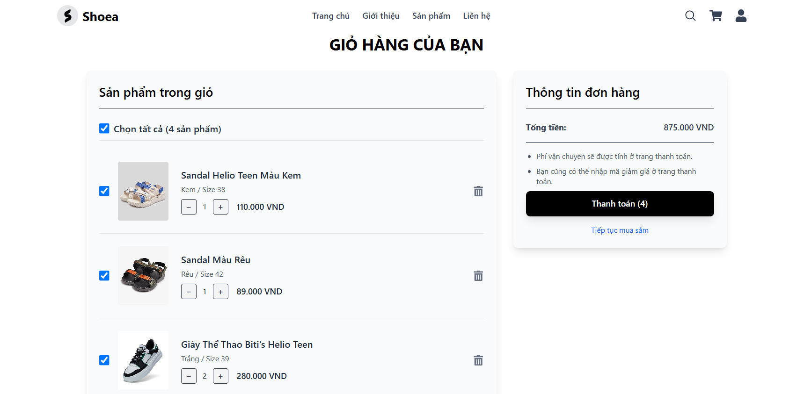
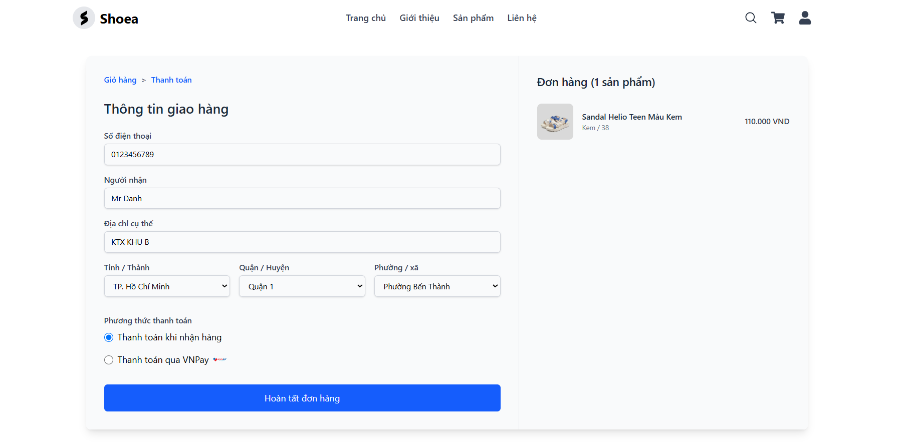
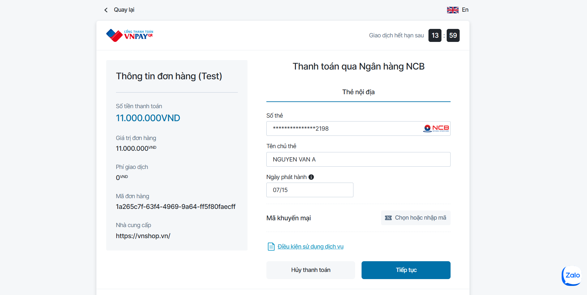
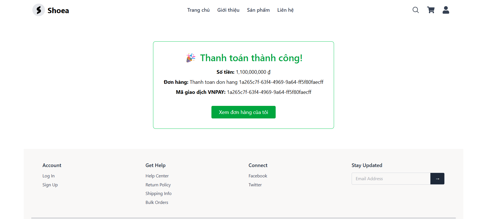
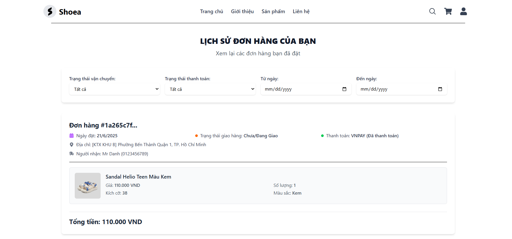

<h1 align="center">🛒 E-Commerce ShoeStore</h1>

<p align="center">
  
</p>

---

## 📖 Introduction

Welcome to **E-Commerce ShoeStore**, a modern, secure, and user-friendly online platform for shopping shoes. Whether you're browsing the latest sneaker drops or managing your inventory, ShoeStore makes the experience seamless for both customers and administrators.

---

## 🚀 Technologies

<p align="center">
  <!-- Backend -->
  
  
  
  

  <!-- Frontend -->

  
  

  <!-- Database -->

  
  

  <!-- Storage -->

  
</p>

---

## 🔎 Core Features

🔷 **User Registration:** Create a secure account with email and password.

🔷 **Login:** Authenticate via email/password or Google OAuth.

🔷 **Search Products:** Quickly find products by name, category, or price range.

🔷 **Admin Dashboard:** Only admins can create, update, or delete categories & products.

🔷 **Add Product:** Admins upload product details; images are stored on Cloudinary.

🔷 **Product Details:** View comprehensive product info and add to cart.

🔷 **Shopping Cart:** Review items in your cart with dynamic total calculation.

🔷 **Checkout:** Enter shipping details and complete payment via VNPAY.

🔷 **Order History:** View past orders and their statuses in your profile.

---

## 📸 Screenshots

<p align="center">
  
  
</p>
<p align="center">
  
  
</p>
<p align="center">
  
  
</p>
<p align="center">
  
</p>


---

## 🛠️ Setup & Installation

1. **Clone the repository**:

   ```bash
   git clone https://github.com/mrDanh11/Ecommerce_ShoeStore.git
   cd Ecommerce_ShoeStore
   ```

2. **Environment variables** (backend `.env` and frontend `.env`):

   ```bash
   # Backend (.env)
   PORT=
   WEB_URL=

   SUPABASE_URL=
   SUPABASE_SERVICE_ROLE_KEY=
   SUPABASE_BUCKET=

   VNPAY_SECRET=your_secret
   VNPAY_TMN=your_tmn_code

   TOKEN_SECRET_KEY=your_jwt_secret
   RESET_PASSWORD_SECRET=your_reset_token_secret_here

   EMAIL_USER=
   EMAIL_PASS=

   # Frontend (.env)
   REACT_APP_API_URL=your_api_url
   REACT_APP_GOOGLE_CLIENT_ID=your_google_client_id
   ```

3. **Install & Run**:

   ```bash
   # Backend
   cd backend
   npm install
   npm start

   # Frontend
   cd ../frontend
   npm install
   npm run dev
   ```

Visit `http://localhost:5173` in your browser.

---

## 📐 Project Architecture

```
frontend (React + Tailwind)
  ├── /src
  │   ├── components   # UI components
  │   ├── pages        # Page views
  │   └── services     # API calls

backend (Express + JWT)
  ├── /controllers     # Request handlers
  ├── /models          # Database schemas
  ├── /routes          # API endpoints
  └── /middlewares     # Auth & permissions

database (PostgreSQL + Supabase Realtime)
  ├── users
  ├── products
  ├── categories
  └── orders
```

---

## 💡 Future Enhancements

* Real-time customer support chat
* Product reviews & ratings
* Push notifications for promotions
* AI-powered product recommendations

---

## 📞 Contact

* **Authors:** Nguyen Chi Danh | Le Thanh Dat | Tran Trong Nghia | Ngo Gia Long | Dinh Le Gia Nhu

Thank you for checking out ShoeStore! ❤️
